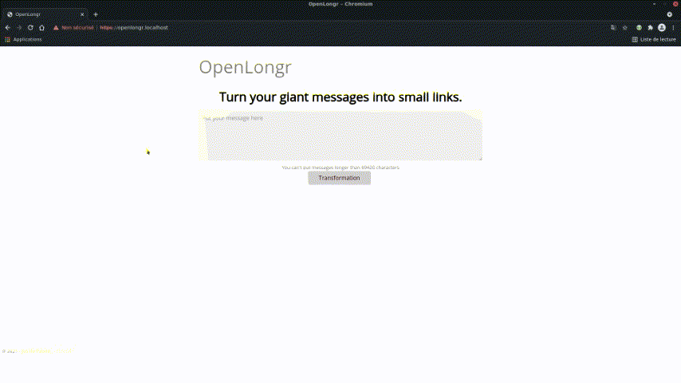

# OpenLongr
[](https://www.codefactor.io/repository/github/jusdepatate/openlongr)



OpenLongr is a user-friendly privacy-focused alternative to TwitLonger. (now with dark theme too)

No account or login required, just type your text (OpenLongr supports markdown) and it'll be published in a second.

The database only stores three information about messages, they are the ID of the message, the content and the country of the user that sent it (based on IP, but IP isn't stored).

## Installation
### Requirements
- a MySQL Database,
- `composer` (to install [Parsedown](https://github.com/erusev/parsedown)),
- PHP 7 or better,
- PHP's `curl`.

### Downloading
```shell
git clone https://github.com/jusdepatate/openlongr.git
// could use `sudo -u http git clone ...`
```
**OR**
```shell
wget https://github.com/jusdepatate/OpenLongr/archive/refs/heads/master.zip
unzip master.zip
```

and then
```shell
composer install
```

### Configuration
- Everything is in `env.php` (create it by copying `env.example.php`),
- Execute `setup.php` and then you can delete it (if it tells you to).

## Monitoring
I have created the script `status.php` to use with any uptime/monitoring (I use [Uptime Kuma](https://github.com/louislam/uptime-kuma) for example) that supports json/string keyword.

Example request when everything is right: `curl http://openlongr.localhost/status.php -L`
```json
{"status": "OK"}
```